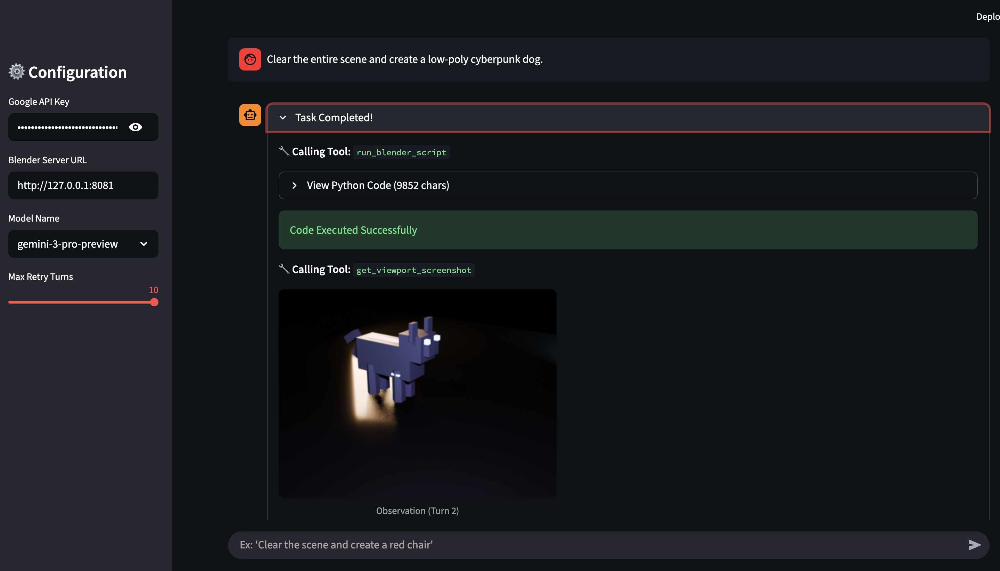

# BlenderGeminiAgent

BlenderGeminiAgent is an autonomous AI agent that controls Blender using natural language.

Powered by Google's Gemini 2.5 or 3, this agent acts as a "Ghost in the Shell" for Blender. It writes Python scripts (
`bpy`), executes them, visually inspects the result via rendered screenshots, and autonomously corrects its own code if
errors occur or if the visual result doesn't match your instructions.

MCP-style PULL Architecture: Instead of sending the entire scene data context, the Agent uses tools to "pull" only the
necessary information (visuals/logs), similar to how MCP servers operate. However, it is not an MCP as a technical
standard.

```plaintext
project_root/
├── BlenderGeminiAgent/        # [Server] Blender Extension (Add-on)
│   ├── blender_manifest.toml  # Extension definition
│   └── __init__.py            # Server logic (HTTP Server + Context Overrides)
│
└── app.py                     # [Client] Streamlit Web UI (The Brain)
```

## 🌟 Key Features

- Natural Language Control: Just ask "Create a cyberpunk chair" or "Make the sphere green".
- Multimodal Feedback (Vision): The agent doesn't just guess; it renders the scene and "sees" the result to verify its
  work.
- Autonomous Self-Correction:
    - Context Awareness: Automatically handles complex Blender context overrides to prevent Poll failed errors.
    - Error Recovery: If a Python error occurs (e.g., "keyword unrecognized"), the agent analyzes the traceback and
      fixes the code instantly.
- PULL Architecture: efficient communication that only transfers data (images/logs) when the AI requests it, saving
  tokens and bandwidth.

## 🚀 Setup & Installation

### 1. Server Side (Blender Extension)

This sets up a local HTTP server inside Blender to receive commands.

Prerequisites:

- Blender 4.2 or later (Required for the Extension system).

Installation:

1. Navigate to the BlenderGeminiAgent folder.
2. Select both blender_manifest.toml and __init__.py, and compress them into a ZIP file (e.g., BlenderGeminiAgent.zip).
3. Open Blender. Go to Edit > Preferences > Get Extensions.
4. Click the arrow icon in the top-right corner and select "Install from Disk...".
5. Select your BlenderGeminiAgent.zip.

Starting the Server:

1. In the Blender 3D Viewport, press F3 (or use the Search Menu).
2. Type Start Agent Server and press Enter.
3. You should see a message: "Server started on port 8081".

### 2. Client Side (Streamlit App)

This runs the AI logic and Web UI.

Prerequisites:

- Python 3.11+.
- A Google AI Studio API Key.

```bash
pip install streamlit google-generativeai requests pillow
```

## 🎮 Usage



1. Ensure Blender Server is Running: Make sure you have executed `Start Agent Server` inside Blender.
2. Launch the Web UI: Run the following command in your terminal:

```bash
streamlit run app.py 
```

Your browser will automatically open `http://localhost:8501`.

3. Configuration (Sidebar):
    - Google API Key: Enter your API key (required).
    - Blender Server URL: Default is http://127.0.0.1:8081.
    - Model Name: Choose available models.
    - Max Retry Turns: Set how many times the AI can autonomously try to fix errors per request (Default: 5).
4. Start Creating: Type your command in the chat input.
    - Example: "Clear the scene, then create a glossy red monkey head facing the camera."

What happens next:

- Status Box: You will see "Agent is working...". Expand it to see the Python code being generated and executed.
- Vision: If the agent needs to check the shape or color, it will capture a render. This image will appear in your chat
  timeline.

## 🛠 Troubleshooting

| Issue               | 	Possible Cause & Solution                                                                                                                                    |
|---------------------|---------------------------------------------------------------------------------------------------------------------------------------------------------------|
| Connection Refused  | 	The Blender server is not running. Go to Blender, press F3, and run Start Agent Server.                                                                      |
| Timeout Error       | 	Rendering took longer than 30 seconds. Try asking the agent to "Use Eevee engine" or "Low resolution" to speed up renders.                                   |
| Black Image         | 	The scene has no lights. The agent usually handles this, but you can remind it: "Add a camera and lights so you can see."                                    |
| "Poll failed" Error | 	The agent tried to use an operator (bpy.ops) in the wrong context. The system usually fixes this automatically using the built-in get_view3d_context helper. 

## ⚠️ Disclaimer

- Security: The server executes Python code sent to localhost:8081. Only run this on a trusted local network.
- Cost: Extensive usage (especially Vision) may incur costs if you are on a Pay-as-you-go plan. Check your Google AI Studio dashboard.